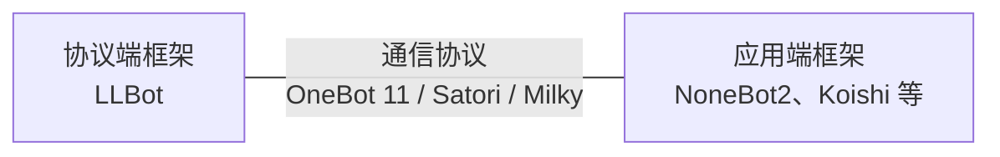

[LLBot](https://github.com/LLOneBot/LuckyLilliaBot)（全称 LuckyLilliaBot / 幸运莉莉娅）是一个基于 PC NTQQ 客户端的 QQ 机器人框架，作为中间层调用 QQ 内部 API，将 QQ 的功能通过 HTTP 等形式暴露出来，供开发者编写自定义的应用逻辑使用。

现代 QQ Bot 开发往往有三层结构：

- 协议端：负责调用 QQ 客户端功能 / 模拟 QQ 客户端行为的部分。LLBot 即属于这一层。
- 应用端：基于协议端提供的接口，编写自定义应用逻辑的部分。
- 通信协议：协议端与应用端之间的接口规范，约定了两者之间的通信方式、数据格式等。LLBot 支持的协议有 [OneBot 11](https://github.com/botuniverse/onebot-11)、[Satori](https://satori.chat/zh-CN/protocol/) 和 [Milky](https://milky.ntqqrev.org/)。

如果你刚刚接触 Bot 开发，那么一般而言，基于应用端框架进行开发是一个不错的选择。应用端框架将相对底层的操作如网络连接、消息序列化等封装起来，使开发者能够更专注于业务逻辑的实现。同时，应用端框架通常提供了丰富的插件生态，可以满足各种常见需求。常见的应用端框架有：

- [NoneBot2](https://nonebot.dev/) - 基于 Python 的 Bot 框架，适合从头开始构建自己的 Bot 应用。
- [Koishi](https://koishi.chat/) - 基于 Node.js 的 Bot 框架，有开箱即用的 WebUI 和插件市场，适合快速搭建 Bot 应用。

准备好了吗？让我们开始吧！
