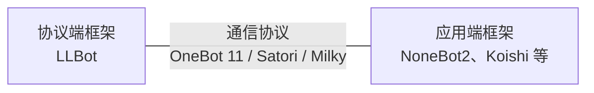

import { Mermaid } from '@/components/mdx/mermaid'

[LLBot](https://github.com/LLOneBot/LuckyLilliaBot)
（全称 LuckyLilliaBot, 幸运莉莉娅）是一个基于原版电脑 NTQQ 的 QQ 机器人框架，
通过 PMHQ 将 QQ 的功能暴露出来，再通过 LLBot 封装成标准协议通过 WS, HTTP 等形式暴露出来，供开发者编写自定义的应用逻辑使用。

如果你对 LLBot 有疑问欢迎加入以下社群提问

TG: [https://t.me/luckylillia](https://t.me/luckylillia)

QQ: [545402644](https://qm.qq.com/q/3k5fzILp7y)

## 工作原理

<Mermaid chart={`flowchart LR
    A[NTQQ 原版QQ] <--> B[PMHQ注入 暴露QQ功能]
    B <--> C[LLBot 转换协议]
    C <--> D[机器人框架 功能实现]
`} />

现代 QQ Bot 开发往往有三层结构：

- 协议端：负责调用 QQ 客户端功能 / 模拟 QQ 客户端行为的部分。LLBot 即属于这一层。
- 应用端：基于协议端提供的接口，编写自定义应用逻辑的部分。
- 通信协议：协议端与应用端之间的接口规范，约定了两者之间的通信方式、数据格式等。

LLBot 支持的协议有 [OneBot 11](https://github.com/botuniverse/onebot-11)、[Satori](https://satori.chat/zh-CN/protocol/) 和 [Milky](https://milky.ntqqrev.org/)。

直接对接协议从零开发参考[对接协议开发](./develop)

## 支持的框架

如果你刚刚接触 Bot 开发，那么一般而言，基于应用端框架进行开发是一个不错的选择。

应用端框架将相对底层的操作如网络连接、消息序列化等封装起来，使开发者能够更专注于业务逻辑的实现。

同时，应用端框架通常提供了丰富的插件生态，可以满足各种常见需求。

常见的应用端框架有：

- [NoneBot2](https://nonebot.dev/docs/) 基于 Python 的聊天机器人框架，该框架偏向于有基础的开发者
- [Koishi](https://koishi.chat/zh-CN/) 基于 NodeJS 的跨平台聊天机器人框架，自带 UI 交互和插件市场

框架对接参考[对接框架](./install_framework)

如果你有发现更多好用的框架或者成品 Bot，欢迎提交[PR 或 Issue](https://github.com/LLOneBot/LuckyLilliaDoc)

## 开始使用

准备好了吗？前往 [安装](/guide/choice_install) 了解如何安装 LLBot。
