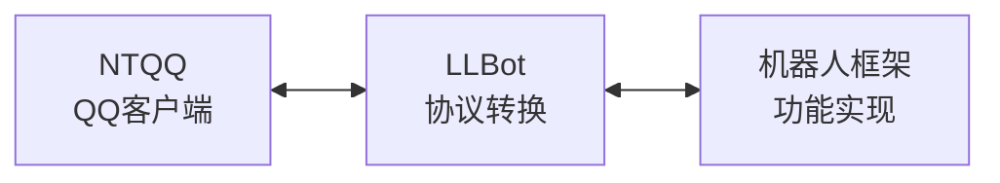

# 什么是 LLBot

[LLBot](https://github.com/LLOneBot/LuckyLilliaBot)（全称 LuckyLilliaBot, 幸运莉莉娅）是一个基于 NTQQ 的 QQ 机器人框架，将 QQ 的功能通过特定的协议暴露出来，使你能用通过编程的形式调用 QQ

## 工作原理

LLBot 作为中间层，负责与 QQ 客户端通信，并将消息转换为标准协议格式，供机器人框架/你自己开发使用。

## 支持的协议

*如果你没有任何编程基础，不需要关心协议，直接使用现成框架对接即可。*

什么是协议？协议就是通过特定的连接方式，特定的数据格式来调用或者获取 QQ 的相关信息。

LLBot 目前支持 OneBot11/GoCQ, Milky, Satori 协议。

直接对接协议从零开发参考[对接协议开发](./develop.md)

## 支持的框架

什么是框架，框架就是将协议相关的高度封装，不需要关心底层逻辑，让你轻松编写代码对接，只关心业务即可。

甚至可以不需要编写代码直接使用现成框架插件搭建一个直接可使用的机器人。

- [NoneBot2](https://nonebot.dev/docs/) 基于 Python 的聊天机器人框架，该框架偏向于有基础的开发者
- [Koishi](https://koishi.chat/zh-CN/) 基于 NodeJS 的跨平台聊天机器人框架，自带 UI 交互和插件市场

框架对接参考[框架对接配置](./config_framework.md)

如果你有发现更多好用的框架或者成品 Bot，欢迎提交[PR 或 Issue](https://github.com/LLOneBot/LuckyLilliaDoc)

## 开始使用

准备好了吗？前往 [安装](./install.md) 了解如何安装 LLBot。
